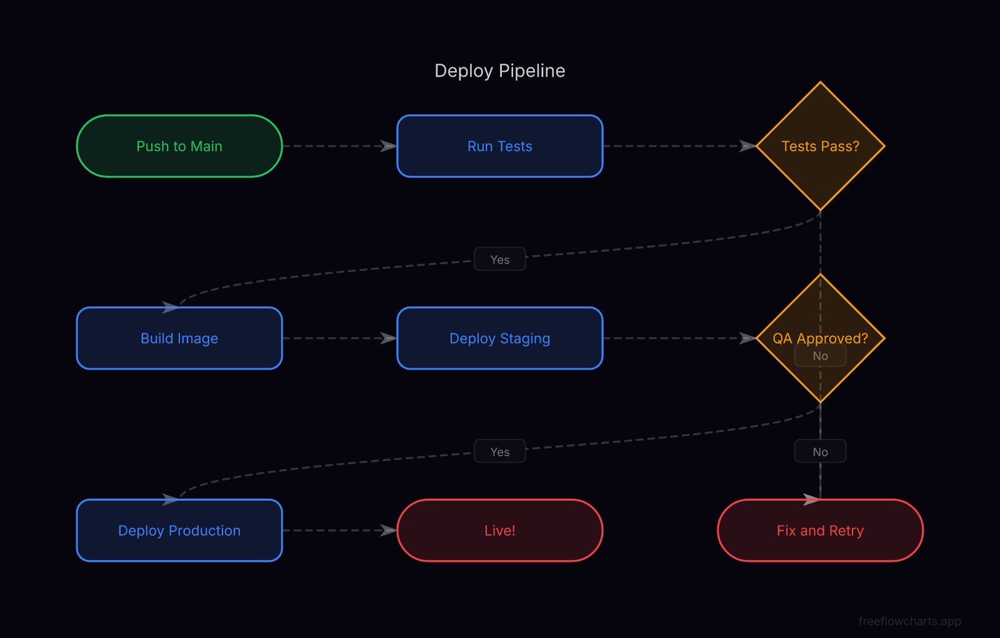
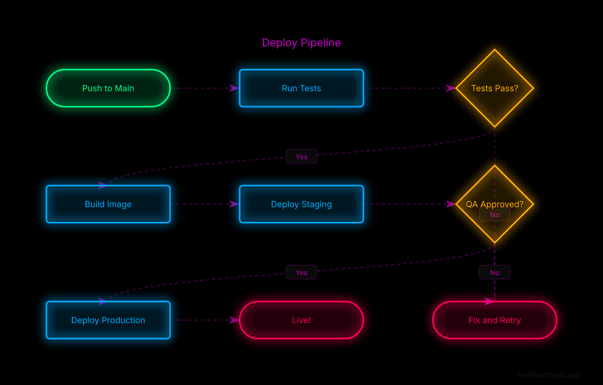
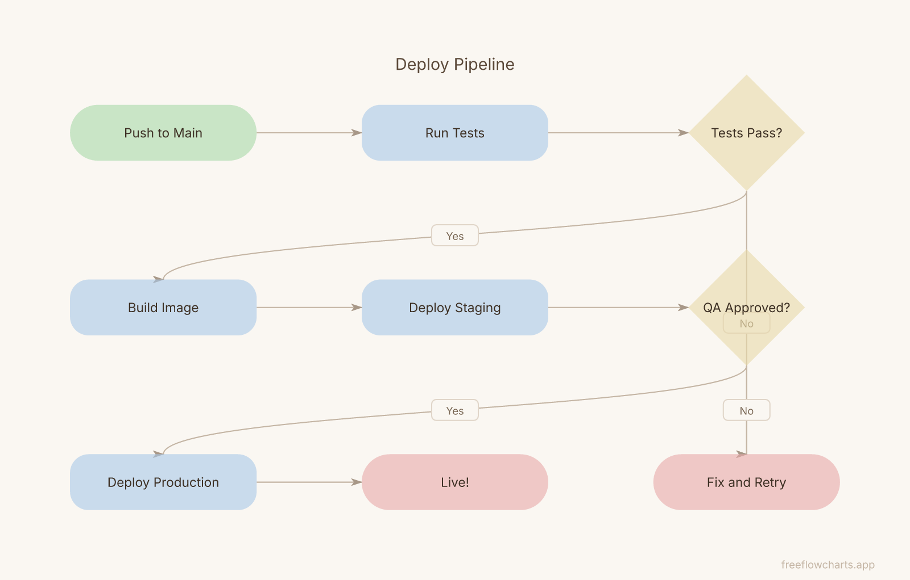
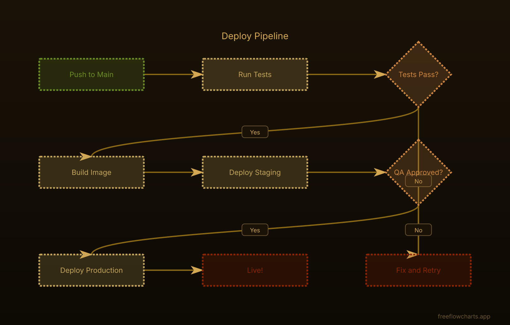
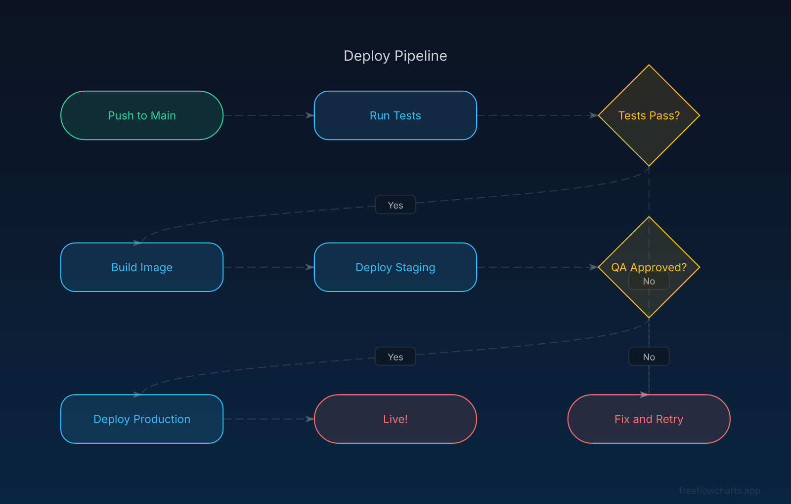
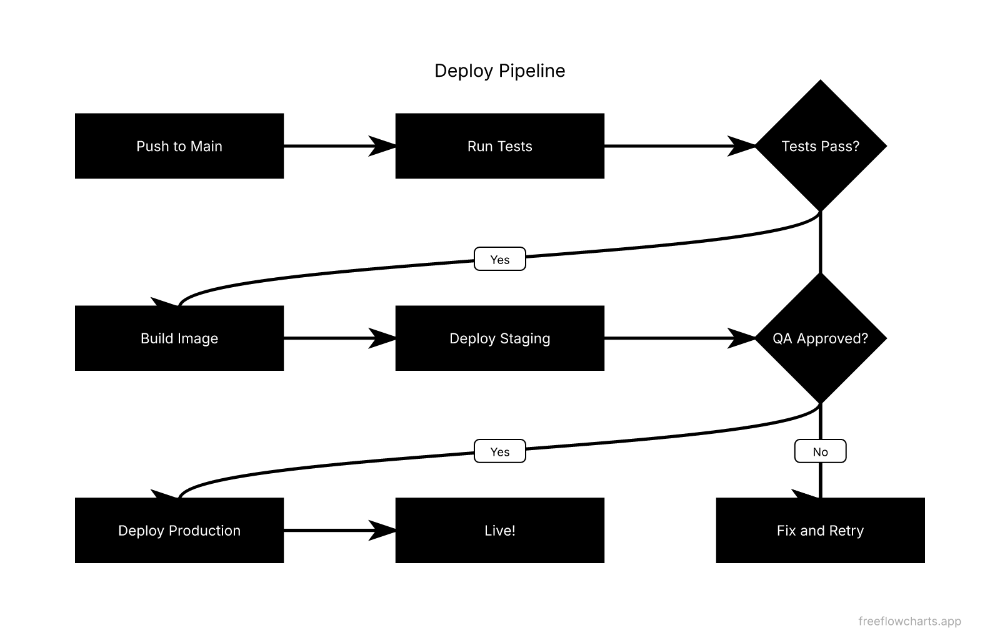
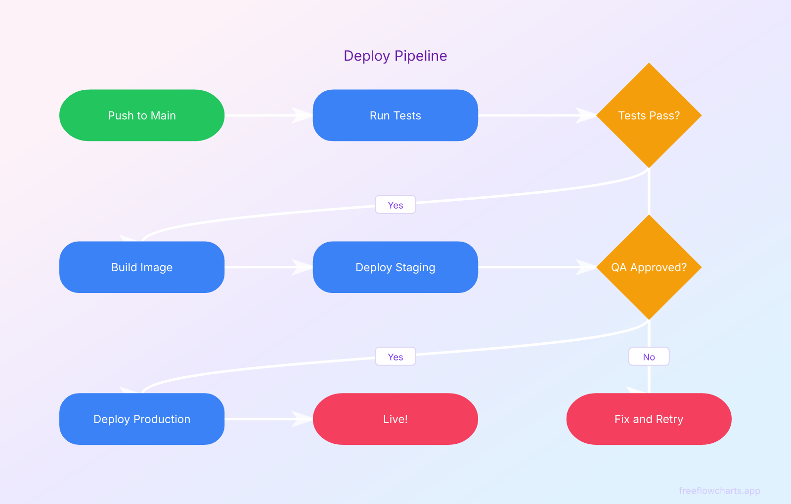

# FreeFlowCharts API

> **Free public API** for creating, exporting, and sharing interactive flowcharts. No API key required.

**Live app:** [freeflowcharts.app](https://freeflowcharts.app)
**API docs page:** [freeflowcharts.app/api-docs](https://freeflowcharts.app/api-docs)
**OpenAPI spec:** [freeflowcharts.app/openapi.json](https://freeflowcharts.app/openapi.json)

---

## Quick Start

Create a flowchart in one request:

```bash
curl -X POST https://freeflowcharts.app/api/create-flowchart \
  -H "Content-Type: application/json" \
  -d '{
    "title": "My Flow",
    "createdBy": "My Agent",
    "nodes": [
      { "id": "1", "type": "start", "label": "Begin" },
      { "id": "2", "type": "process", "label": "Do work" },
      { "id": "3", "type": "decision", "label": "Done?" },
      { "id": "4", "type": "end", "label": "Finish" }
    ],
    "edges": [
      { "from": "1", "to": "2" },
      { "from": "2", "to": "3" },
      { "from": "3", "to": "4", "label": "Yes" },
      { "from": "3", "to": "2", "label": "No" }
    ],
    "theme": "neon"
  }'
```

**Response:**
```json
{
  "success": true,
  "flowId": "abc123",
  "shareId": "k7Rm2xP9qWnE",
  "url": "https://freeflowcharts.app/view/k7Rm2xP9qWnE",
  "embed": "<iframe src=\"https://freeflowcharts.app/view/k7Rm2xP9qWnE\" width=\"800\" height=\"600\" frameborder=\"0\"></iframe>",
  "branding": "Powered by FreeFlowCharts — https://freeflowcharts.app"
}
```

---

## Endpoints

| Method | Endpoint | Description |
|--------|----------|-------------|
| `POST` | `/api/create-flowchart` | Create a flowchart and get a shareable link |
| `GET` | `/api/export/json?id=<shareId>` | Export as structured JSON |
| `GET` | `/api/export/mermaid?id=<shareId>` | Export as Mermaid syntax (`text/plain`) |
| `GET` | `/api/export/svg?id=<shareId>` | Export as SVG image (`image/svg+xml`) |
| `GET` | `/api/export/png?id=<shareId>` | Export as PNG image (`image/png`, 1600px wide) |
| `GET` | `/api/node-types` | List all 19 supported node types |
| `GET` | `/api/health` | API status and endpoint listing |

---

## Create Flowchart — Request Body

| Field | Type | Required | Description |
|-------|------|----------|-------------|
| `title` | string | Yes | Flowchart title (max 200 chars) |
| `description` | string | No | Description (max 1000 chars) |
| `createdBy` | string | No | Attribution (e.g. "ChatGPT", "My Agent") |
| `nodes` | array | Yes | Array of node objects (1–100) |
| `nodes[].id` | string | Yes | Unique node ID |
| `nodes[].type` | string | No | Node type (default: `"process"`) — see [Node Types](NODE_TYPES.md) |
| `nodes[].label` | string | Yes | Display label (max 200 chars) |
| `nodes[].description` | string | No | Node description (max 500 chars) |
| `nodes[].x` | number | No | X position (auto-layout if omitted) |
| `nodes[].y` | number | No | Y position (auto-layout if omitted) |
| `edges` | array | Yes | Array of edge objects (0–200) |
| `edges[].from` | string | Yes | Source node ID |
| `edges[].to` | string | Yes | Target node ID |
| `edges[].label` | string | No | Edge label (max 100 chars) |
| `background` | string | No | Hex color (`#1a1a2e`) or CSS `linear-gradient(...)`. Default: `#06040d` |
| `theme` | string | No | Visual theme — see [Themes](THEMES.md) |

---

## Export Endpoints

All export endpoints accept optional query parameters:

| Param | Description |
|-------|-------------|
| `id` | **(required)** The `shareId` returned when the flowchart was created |
| `bg` | Override background color/gradient for this export |
| `theme` | Override visual theme for this export |

**Priority:** `?bg=` override > stored `background` > theme background > default (`#06040d`)
**Priority:** `?theme=` override > stored `theme` > `"default"`

### JSON Export

The JSON export includes both stored and resolved values:

| Field | Description |
|-------|-------------|
| `theme` | Stored theme (what was saved at creation) |
| `background` | Stored background (what was saved at creation) |
| `resolvedTheme` | Effective theme after `?theme=` override |
| `resolvedBackground` | Effective background after `?bg=` / theme resolution |
| `availableThemes` | Array of all valid theme names |

### Examples

```bash
# Export as Mermaid syntax
curl "https://freeflowcharts.app/api/export/mermaid?id=YOUR_SHARE_ID"

# Export as SVG
curl "https://freeflowcharts.app/api/export/svg?id=YOUR_SHARE_ID" -o flow.svg

# Export as PNG
curl "https://freeflowcharts.app/api/export/png?id=YOUR_SHARE_ID" -o flow.png

# Override background on export
curl "https://freeflowcharts.app/api/export/svg?id=YOUR_SHARE_ID&bg=%231a1a2e" -o custom.svg

# Override theme on export
curl "https://freeflowcharts.app/api/export/png?id=YOUR_SHARE_ID&theme=candy" -o candy.png
```

---

## Error Codes

| Status | Meaning |
|--------|---------|
| 400 | Missing or invalid fields |
| 404 | Flowchart not found (export) |
| 405 | Wrong HTTP method |
| 429 | Rate limit exceeded (30/hr per IP) |
| 500 | Internal server error |

---

## Rate Limits

- **30 requests per hour** per IP address
- Applies to both create and export endpoints
- No API key or authentication required

---

## Theme Previews

All 7 themes applied to the same flowchart:

| Default | Neon | Pastel |
|---------|------|--------|
|  |  |  |

| Retro | Ocean | Brutalist |
|-------|-------|-----------|
|  |  |  |

| Candy |
|-------|
|  |

See **[THEMES.md](THEMES.md)** for full descriptions and usage details.

---

## Further Reading

- **[Node Types](NODE_TYPES.md)** — All 19 node types with colors and descriptions
- **[Themes](THEMES.md)** — Visual theme guide with descriptions
- **[OpenAPI Spec](openapi.json)** — Machine-readable API specification
- **[Agent Skill File](freeflowcharts-api.skill)** — Packaged skill for AI agents
- **[Examples](examples/)** — Code examples in bash, Python, and JavaScript

---

## Links

| Resource | URL |
|----------|-----|
| Live app | https://freeflowcharts.app |
| API docs page | https://freeflowcharts.app/api-docs |
| OpenAPI spec | https://freeflowcharts.app/openapi.json |
| Skill file | https://freeflowcharts.app/SKILL.md |
| LLM info | https://freeflowcharts.app/llms.txt |

---

*Built by [FreeFlowCharts](https://freeflowcharts.app) — free flowchart maker with AI*
